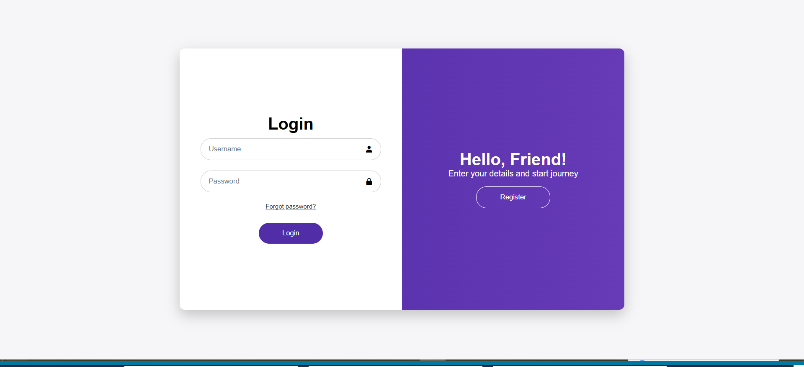

# Purple-Web — Interactive Web Application

  

## 📌 Project Overview

Purple-Web is a lightweight interactive website built using HTML, CSS, and JavaScript.  
It showcases clean frontend structure, responsive layout, and basic DOM interaction — ideal as a foundational project demonstrating core web development competencies.

This project is suitable for showcasing frontend fundamentals to recruiters and technical hiring managers.

---

## 🚀 Core Technologies

| Layer | Technology |
|-------|------------|
| Structure | HTML |
| Styling | CSS |
| Interaction Logic | JavaScript |

This distribution demonstrates capability to design decorated UI with responsive CSS and dynamic features using JavaScript.

---

## 📁 Project Structure

Purple-Web/
│
├── index.html
├── style.css
├── script.js
├── README.md
└── public/
    └── purple-web-preview.png
- index.html – Main webpage layout  
- style.css – UI design and layout styling  
- script.js – Frontend interaction logic

---

## 📥 Installation & Local Usage

1. Clone the repository:

git clone https://github.com/jawasakher/Purple-Web.git
2. Navigate into the folder:

cd Purple-Web
3. Open the application in your browser:

index.html
That's it — the app runs statically without backend.

---

## 🧠 Technical Highlights

- Semantic HTML layout  
- Responsive design via CSS  
- JavaScript DOM manipulation for interactivity  
- Clean separation of concerns

These fundamentals are key requirements in modern frontend roles.

---

## 📸 Screenshot Preview

Include a visual representation of the app by adding:

/public/purple-web-preview.png
This helps recruiters visualize the UI without running code.

---

## 📄 Potential Enhancements

To elevate this project for enterprise portfolios:

- Add modular component structure with modern framework (React/Vue)  
- Implement UI state updates (animations, themes)  
- Add accessibility improvements (ARIA, keyboard navigation)  
- Add deployment (GitHub Pages / Netlify)

---

## 👤 About the Developer

Jawa Sakher  
Frontend Developer specializing in modern UI patterns, responsive layouts, and interactive web applications.

GitHub: https://github.com/jawasakher

---

## 📄 License

This project is licensed under the MIT License.
